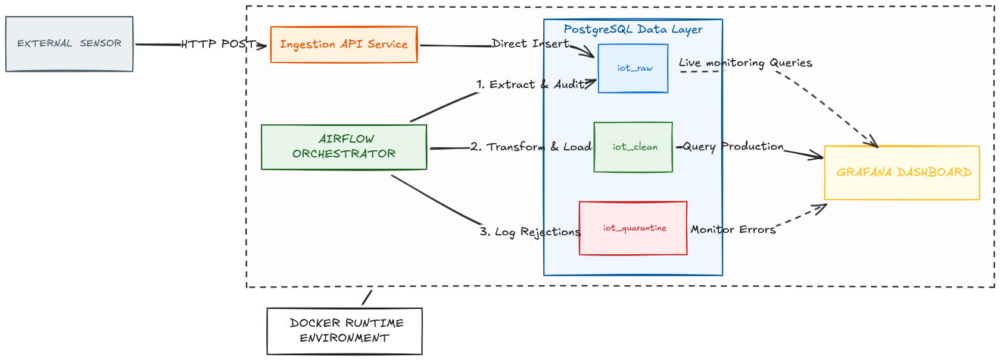
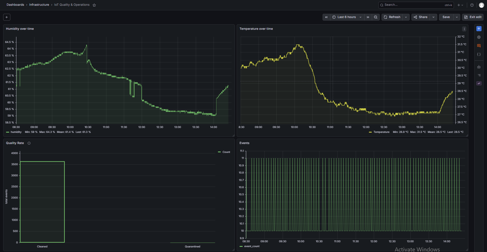
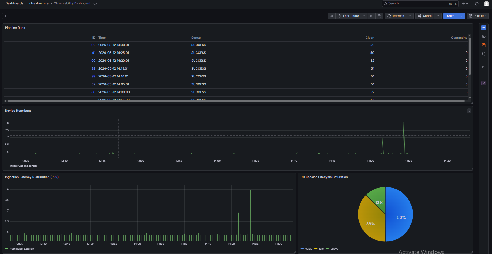
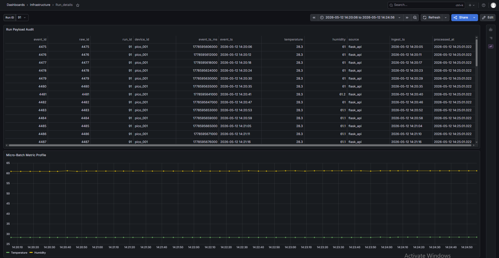

# iot-data-platform
Containerized IoT data platform with orchestration, ETL, and observability layer
## Quick Start
1. Clone the repo.
2. Run `docker-compose up -d`.
3. Access the system:
   - **Grafana:** localhost:3000 (Admin/Admin)
   - **Airflow:** localhost:8080 (admin/Airflow)
   - ⚠️ Default credentials are for local development only. Change before production use.
   - ## Hardware Specification
- **Micro-controller:** Raspberry Pi 4 / Zero 2W.
- **Sensor:** DHT22 (AM2302) Temperature & Humidity.
- **Circuit:** 10k Ohm pull-up resistor between VCC and Data pin.
- **Connection:** GPIO 17 (Any GPIO port).
- ## 🏗️ System Architecture

**High-concurrency ingestion loop:**
Sensor → Flask → Bronze (iot_raw) → Airflow ETL → Silver (iot_clean) → Grafana

## Data Governance (Medallion Architecture)
The system implements a multi-layer storage strategy within PostgreSQL to ensure forensic data integrity:

1. **iot_raw (Bronze Layer):**
   - Ingests untouched JSON payloads directly from the sensor.
   - Acts as the immutable "Source of Truth" for replayability.

2. **iot_clean (Silver Layer):**
   - Transformed and validated data.
   - Deduplicated and cast into proper analytical types (Timestamp, Celsius, Humidity %).

3. **iot_quarantine:**
   - Automatically isolates corrupted, out-of-range, or "null" readings.
   - Prevents hardware noise from polluting the analytical dashboards without deleting the evidence.
## Key Features
- **Zero-Touch Provisioning:** Dashboards and Datasources are automatically manifest via YAML configuration.
- **Idempotent ETL:** Airflow pipelines ensure that rerunning a task never duplicates data.
- **Real-time Observability:** Monitoring ingestion jitter (P99) and pipeline success rates.
## System Dashboards

*Real-time monitoring of sensor health and medallion layer throughput.*

*Tracking P99 ingestion jitter and pipeline success metrics.*

*Detailed Execution View: Direct lookup by Run ID to audit specific batch performance and row-level metrics.*

## Engineering
This project demonstrates:
- production-style data pipeline design
- real-time ingestion with edge devices
- medallion architecture applied to IoT telemetry
- failure isolation via quarantine layer
- observability-first system design

 ## Engineering Challenges
-1.Data Pipeline Integrity & State Management
    -1. The Watermark System (Anti-Infinite Loop)
      - The pipeline uses a watermark strategy to track which records have been processed. Initially, I used ingest_ts (timestamp) as the watermark, but this caused reprocessing issues when records arrived out of         order or with identical timestamps.
     - Problem: Multiple records could share the same ingest_ts, and using WHERE ingest_ts > :last_ts would skip records that arrived in the same second as the last processed batch.
     - Solution: Switched to raw_id (auto-incrementing primary key) as the watermark:
    -2. Idempotency & Upserts
       -To prevent duplicate data if a task restarts mid-execution, the pipeline uses ON CONFLICT (raw_id) DO NOTHING logic.
       -Without this: A failed task retry would insert the same records again, corrupting downstream analytics.
       -With this: The pipeline can run multiple times safely—state remains consistent regardless of retries or manual reruns.
     -3. Atomic Transactions (Psycopg2 Context Managers)
       -The Problem: If the data is saved to iot_clean but the system crashes before updating the watermark table, the next run will re-ingest the same records.
       -The Fix: Wrapped the INSERT into the clean layer and the UPDATE of the watermark into a single Psycopg2 Transaction Block (with conn:).
       -Result: Atomic Integrity. If the watermark update fails for any reason, the data insertion rolls back. The system is either 100% updated or 0% changed. No "partial-success" corruption.
-2.Infrastructure Migration & Optimization Challenges
     -1. Network Orchestration & Service Connectivity
       -Port Conflict Resolution: Identified OS-level service interference on Port 5000 (common in modern distributions). Remapped the ingestion API to Port 5001 to ensure non-blocking traffic.
       -Health-Check Bootstrapping: Engineered a startup sequence for the Flask API that verifies PostgreSQL availability and schema integrity before initiating the listener, preventing "race condition" failures.
     -2. Eliminating Ingestion Jitter (Handshake Optimization)
       -Initial monitoring via Grafana revealed periodic 15-second latency spikes during high-concurrency periods.
       -Root Cause: Diagnosed "Handshake Exhaustion."  The system was establishing a fresh TCP/DB connection for every sensor hit, incurring unsustainable overhead.
       -The Solution: Migrated the backend logic to psycopg2.ThreadedConnectionPool.    
       -Result: By maintaining persistent, "pre-warmed" sessions, peak ingestion latency was reduced from 15,000ms to under 20ms, converting the ingestion loop into an industrial-grade pipeline.
     -3. Fault Tolerance & Autonomous Self-Healing
       -Extended observability logs identified psycopg2.InterfaceError events triggered by idle timeouts and TCP interruptions.
       -The Challenge: Stale connections in the pool would occasionally "time out," causing the API to hang while attempting to reuse a severed socket.
       -The Mitigation: Refactored the pool handler to catch Operational and Interface exceptions. The system now automatically purges stale connections and initializes new sessions within a single ingestion               cycle (~6s).
       -Outcome: Achieved a self-healing infrastructure that maintains 100% data capture without manual intervention.
-3. Concurrency Control & Run ID Serialization
      -During the initial orchestration phase, I observed a "Gap" in the pipeline_runs metadata where run_id values would jump non-linearly (e.g., from 51 to 80) despite consistent 5-minute execution intervals.
      -The Problem: Race Conditions. Airflow’s default settings were allowing multiple DAG runs to overlap. If one run lagged, the scheduler triggered a second parallel instance. This led to "Handshake                    Contention" and metadata skipping, as two processes fought for the same watermark.
      -The Fix:Implemented max_active_runs=1 in the DAG configuration to enforce strict Serial Execution.
      -Set catchup=False to prevent the scheduler from triggering a "Burst" of historical runs.
      -Outcome: The pipeline is now Deterministic. Each run must complete and commit its transaction before the next one can boot. This stabilized the run_id sequence and eliminated state-collision risks.
## What I Learned
  -1.Technical:
      Exactly-once semantics require watermarking + idempotency + atomic transactions working together
      Connection pooling isn’t just for performance—it’s critical for fault tolerance in high-frequency ingestion
      Concurrency bugs (like run ID gaps) often hide in orchestration config, not application code
  -2.Operational:
      -Observability must be built in from day one—retrofitting metrics/logs is painful
      -Self-healing systems (like stale connection purging) reduce operational burden significantly
  -3.Architectural:
      -Separation of concerns (raw → staging → analytics) makes debugging and iteration faster
      -Docker networks + health checks eliminate an entire class of startup race conditions
      -Idempotent ETL lets you rerun pipelines confidently without data corruption
