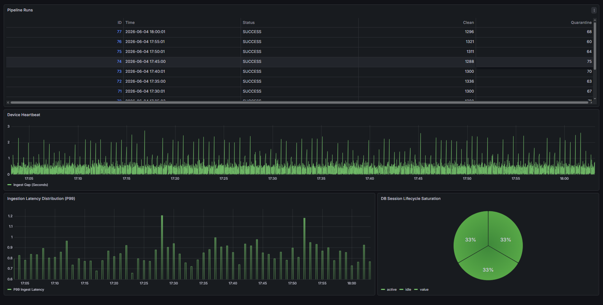
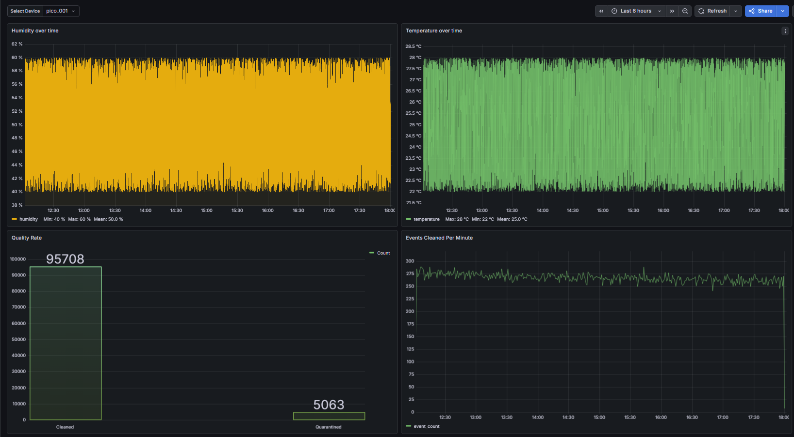
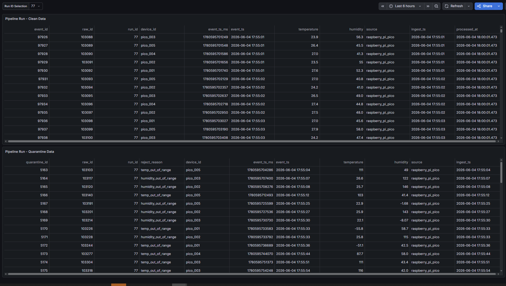
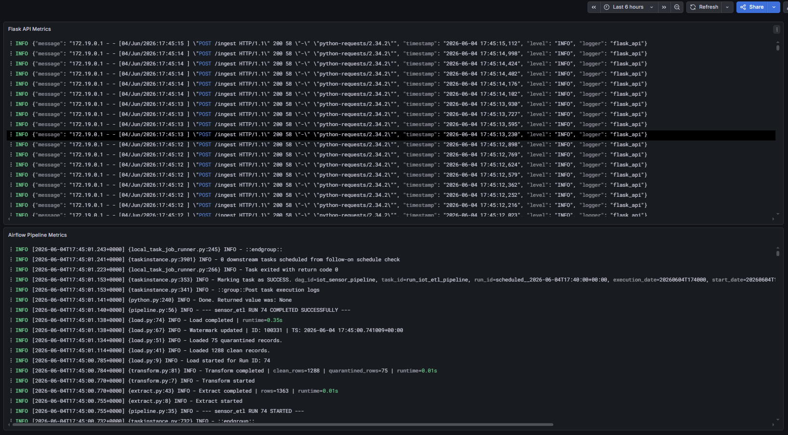

##  What's New in Version 2

###  1. High-Throughput Data Simulator
A Python-based simulator generates **5 events per second** across multiple virtual devices for realistic load testing across ingestion throughput, ETL performance, quarantine logic, and storage behavior under stress.

---

###  2. Expanded Quarantine & Malformed Data Handling
Version 2 introduces stricter validation and more robust quarantine flows:

- **ETL Quarantine** — Invalid or rule-breaking events are routed to `iot_quarantine` for inspection
- **Flask Malformed Data Quarantine** — Non-schema-compliant payloads are captured in a dedicated quarantine inside the Flask ingestion service
- **Strict Version Validation** — Incoming events must match the expected schema version; mismatches are quarantined automatically

---

###  3. Buffer Storage for Ingestion Failures
To handle PostgreSQL unavailability without data loss:

- Local buffer storage for valid events when the database is unreachable
- Automatic retry DAG running every 6 hours
- Buffered events are re-submitted to `iot_raw` once the database is healthy

---

###  4. Structured JSON Logging + Grafana Loki Integration
Both Flask and the ETL pipeline now emit **structured JSON logs**, enabling machine-readable, consistently schemed, searchable logs via a full **Grafana Loki** stack for centralized log aggregation.

---

###  5. TimescaleDB + Hypertables
Load testing revealed ingestion spikes causing high disk I/O and slow inserts. Version 2 addresses this with:

- **TimescaleDB extension** with hypertables on `iot_raw` and time-series tables
- Significantly improved insert performance, query speed, storage efficiency, and long-term scalability

## 🚀 Quick Start

1. Clone the repo
2. Create the environment file:
```bash
   cp .env.example .env
```
3. Start the stack:
```bash
   docker compose up -d
```
4. To run the data simulator, navigate to the scripts folder and activate the virtual environment:
```bash
   cd scripts
   source venv/bin/activate
   python simulator.py
```

### Access the System

| Service | URL | Credentials |
|---|---|---|
| Grafana Dashboards | `localhost:3000` | Admin / Admin |
| Airflow | `localhost:8080` | admin / Airflow |

> ⚠️ Default credentials are for local development only. Change before any production use.
## System architecture
 

## 🔄 Data Flow

### 1. Device → Ingestion Layer
The Device Simulator (or real IoT devices) sends telemetry via **HTTP POST** to the Flask Ingestion API, which performs:

- JSON validation
- Schema + version validation
- Field-level checks

> Malformed or non-JSON payloads are immediately routed to **Flask Quarantine**.

---

### 2. Ingestion → Storage Layer
After validation:

| Condition | Action |
|---|---|
| PostgreSQL/TimescaleDB available | Data inserted into `iot_raw` |
| Database unavailable | Data written to local buffer storage |

A dedicated **Airflow Replay DAG** runs every 6 hours to push buffered data into `iot_raw` once the DB is healthy — ensuring **zero data loss during outages**.

---

### 3. ETL Pipeline — Raw → Clean
Airflow processes new records from `iot_raw` using watermarking (`raw_id`), idempotent inserts, and atomic transactions:

- ✅ Valid events → transformed and enriched → `iot_clean`
- ⚠️ Rule-violating or schema-breaking events → `iot_quarantine`

---

### 4. Observability Layer
All services emit **structured JSON logs** to Loki:

- Flask ingestion logs
- ETL pipeline logs
- Buffer replay logs
- Quarantine events

Grafana dashboards visualize ingestion throughput, ETL performance, clean vs quarantine counts, device activity, and buffer replay metrics — providing **full visibility into system behavior**.

## System Dashboards

### Observability Dashboard


### Quality Dashboard


### Drilldown Dashboard



### Logs Dashboard


## 🔧 Engineering Challenges & Solutions

### 1. Log Ownership & Permission Conflicts
Cloning the repository also cloned the `logs/` directory, introducing a critical startup failure:

| Actor | UID |
|---|---|
| Host machine user | 1000 |
| Flask (inside Docker) | 0 |
| Airflow (inside Docker) | 50000 |

Airflow attempted to write into a folder owned by UID 1000 — resulting in `Permission Denied` on every startup. A classic Docker volume ownership mismatch where host permissions leaked into the container environment.

**Solution:** A dedicated `fix-permissions` initialization service was added to `docker-compose.yml` that runs before any other service, normalizes ownership, separates Flask and Airflow log directories, and prevents host-level permissions from breaking containerized services.

---

### 2. Gunicorn Worker Memory Isolation & Circuit Breaker Inconsistency
The ingestion service originally ran **4 Gunicorn workers**. Each worker maintains its own isolated memory space, which broke the circuit breaker logic entirely:

- Worker A detected DB down → switched to buffer mode
- Worker B still thought DB was up → kept retrying
- Worker C and D logged contradicting states

Debugging was impossible. Each worker was living in a different state universe.

**Solution:** Redesigned the worker model to **1 worker + 8 threads**, ensuring a single shared memory space, consistent circuit breaker behavior, predictable logging, and no more conflicting worker states.

---

### 3. Buffer Storage Permission Issues Between Flask and Airflow
When PostgreSQL is unavailable, Flask writes buffered events as `UID 0 / GID 0`. Airflow runs as `UID 50000 / GID 0`. Despite sharing group 0, the volume mount caused Airflow to hit `Permission Denied` when attempting to read, delete, or clean up buffered files — risking duplicate ingestion and breaking the replay DAG entirely.

**Solution:** Replaced the bind mount with a dedicated Docker-managed volume:

```yaml
buffer_volume:
  driver: local
```

Both Flask and Airflow mount this volume explicitly, ensuring consistent permissions, shared access, safe deletion, and a fully reliable replay mechanism under all conditions.

---

### 4. Ingestion Spikes, TimescaleDB Migration & `/dev/shm` Memory Pressure
Under load testing with tens of thousands of events, vanilla PostgreSQL began showing severe degradation:

- High disk I/O and WAL pressure
- Slow inserts and queue buildup
- Ingestion latency spikes

The root cause was straightforward: PostgreSQL is not optimized for high-frequency time-series inserts.

**Solution — TimescaleDB Migration:**
The storage layer was migrated to TimescaleDB, enabling hypertables, chunking, compression, and significantly faster inserts. This immediately stabilized ingestion performance under load.

**Solution — `/dev/shm` Tuning:**
Under heavy load, Gunicorn worker was buffering incoming requests faster than the OS could flush them, causing worker stalls, sudden restarts, and occasional request drops — especially visible when processing 100k+ events over a few hours.

A dedicated `/dev/shm` shared memory mount was allocated for the Flask container:

```yaml
flask-ingest:
  shm_size: '256mb'
```

Combined with the 1 worker + 8 threads model, this provided faster in-memory buffering, reduced worker stalls, and significantly more predictable latency under bursty traffic.


## 🧠 What I Learned

Building Version 2 surfaced lessons that only appear when working with real systems under real load.

**1. Container permissions are not trivial**
Host-machine file ownership can silently break containerized services. A cloned `logs/` directory with the wrong UID was enough to prevent Airflow from starting. Understanding how Docker propagates permissions across volumes became essential.

**2. Worker models matter more than expected**
Running multiple Gunicorn workers seemed harmless until each worker maintained its own isolated memory — causing inconsistent circuit breaker states and contradictory logs. Switching to a single worker with threaded concurrency provided predictable behavior and easier debugging.

**3. Time-series workloads need time-series databases**
Under high throughput, vanilla PostgreSQL struggled with insert spikes and WAL pressure. Migrating to TimescaleDB with hypertables and chunking immediately stabilized ingestion performance and reduced latency.

**4. Shared memory (`/dev/shm`) tuning can make or break ingestion**
Heavy bursts of incoming data exposed shared memory pressure inside the container. Allocating a dedicated `/dev/shm` mount prevented worker stalls and kept ingestion smooth.

**5. Cross-service coordination requires explicit design**
Flask and Airflow interacting with the same buffer directory revealed how subtle permission mismatches can break replay logic. Using a dedicated Docker-managed volume ensured consistent access and reliable cleanup.

**6. Observability is not optional**
Structured JSON logs, Loki, and Grafana dashboards turned debugging from guesswork into clarity. Once observability was in place, every subsystem became easier to reason about and faster to fix.


